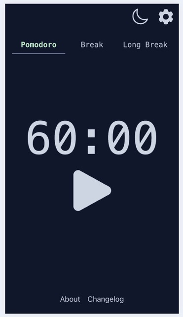
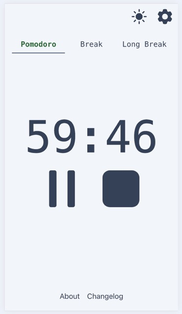
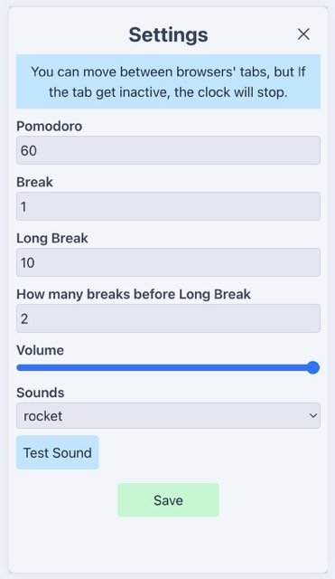

# Pomodoro

Web: https://pyroxenestudio.github.io/pomodoro/

It just a Pomodoro, you select the time for every mode (Pomodoro, Break and Long Break) and click play

- You can choose the sound 
  - Cat
  - Dog
  - Rocket

- How many breaks before long break
- It doesn't render the clock while the tab is in the background, so the energy impact is good.
- You can select Dark or Light theme
- The information is saved in the localStorage
- Desktop - mobile (portrait / landscape)

## The sound are from:
- [Dog - RibhavAgrawal](https://pixabay.com/sound-effects/dog-bark-type-01-293298/)
- [Cat - RibhavAgrawal](https://pixabay.com/sound-effects/dog-bark-type-01-293298/)
- [Rocket - SonixFXSounds](https://pixabay.com/sound-effects/dog-bark-type-01-293298/)

## Images

